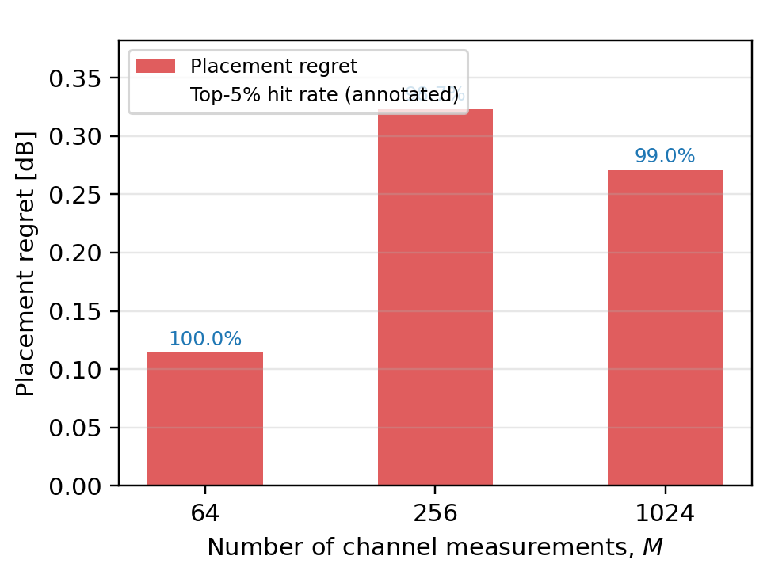
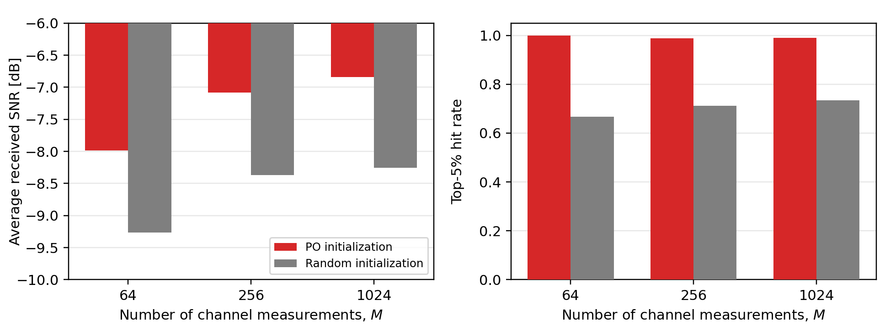
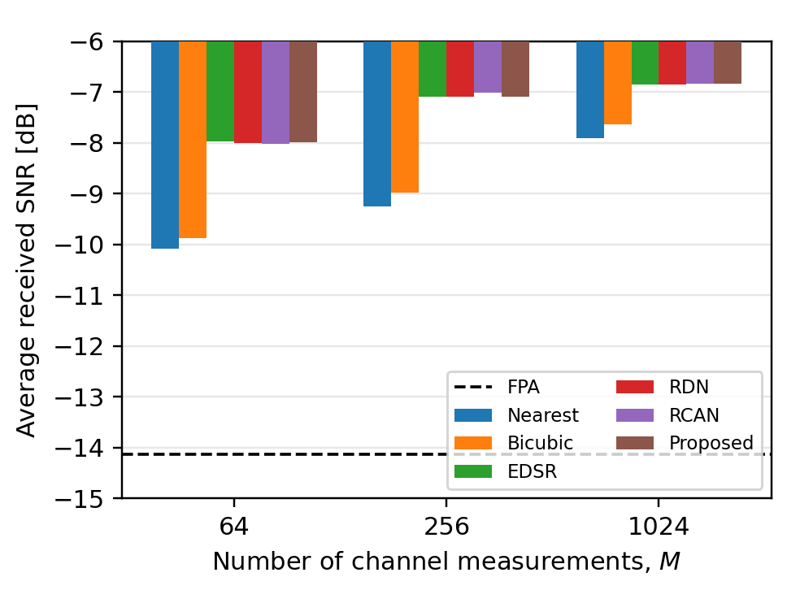
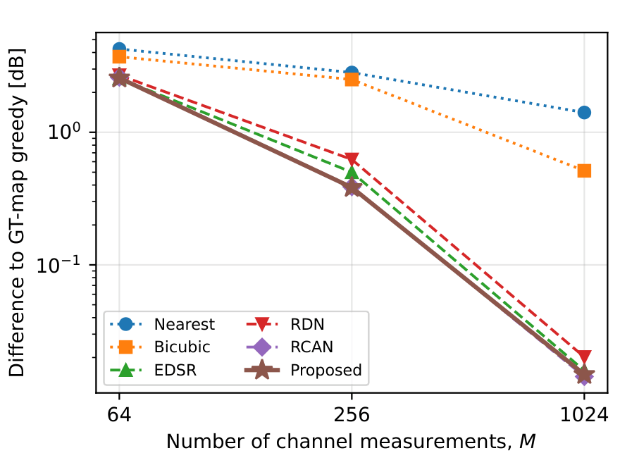
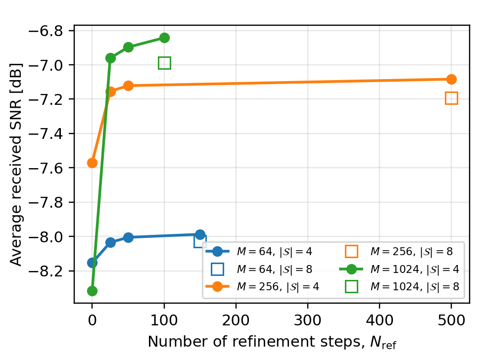
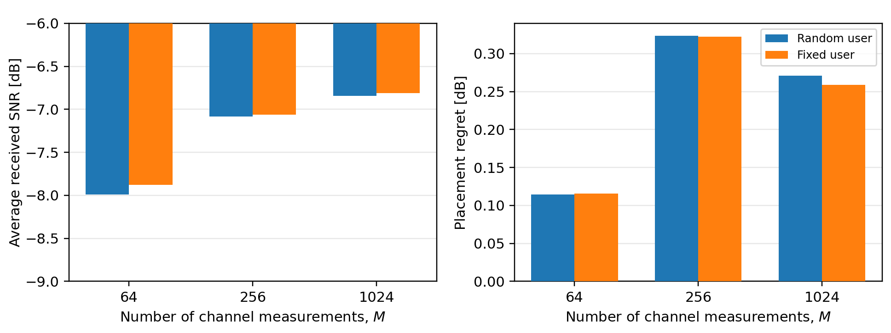
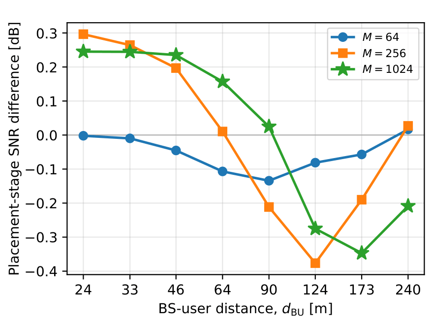

# Supplementary experiments

Additional results for the paper on movable-antenna (MA) placement from
reconstructed spatial channel maps. This repository provides supplementary experimental results and reproducibility details that complement the results reported in the main manuscript.

The repository contains supplementary results and evaluation details only.
The simulation and training code is not released.

---

## 1. What the paper does

A base station has a small aperture over which two antennas can be positioned
freely. The received SNR depends on where they sit, so choosing the positions
requires knowing the spatial channel over the whole aperture — which would
normally mean probing every candidate location.

The paper avoids that with a two-stage pipeline:

1. **Reconstruction.** The aperture is characterized using only `M` finite-resolution spatial
   observations. A super-resolution network reconstructs the full 128 × 128 SNR
   map from these observations. With `M = 1024` this is 6.25 % of the grid; with `M = 64`
   it is 0.39 %.

2. **Placement.** A placement network (PO) reads the reconstructed map and
   emits continuous antenna coordinates in one forward pass. A short
   gradient-based refinement then polishes them, and a feasibility correction
   guarantees the minimum-spacing constraint is met.

The paper shows that the proposed method approaches the dense-grid placement
reference while using substantially fewer probing observations and online
objective evaluations.

### Setup common to every experiment below

| | |
|---|---|
| Aperture | 0.6 × 0.6 m, discretized to 128 × 128 (16 384 candidate points) |
| Carrier | 5 GHz |
| Movable antennas | `K = 2`, minimum spacing 18 mm |
| Observations | `M ∈ {64, 256, 1024}` |
| Evaluation | 5 000 held-out channel realizations |
| Placement training | spacing-penalty weight `λ_d = 0.1` |
| Inference refinement | `N_ref = 150 / 500 / 100` for `M = 64 / 256 / 1024`, no repulsion term |

**Reference and regret.** Several figures report *placement regret*: the SNR of the grid-based greedy
reference minus the SNR achieved by the proposed method, evaluated on the same
reconstructed map. Lower is better; zero means the learned placement matched the grid-based greedy reference, which
evaluates all 16 384 grid points at each antenna-placement step.

---

## 2. Experiments

### 2.1 Placement regret and top-5 % hit rate versus observation budget

How much does the placement stage give up relative to the grid-based greedy
reference, and how often does it land in the strongest 5 % of the aperture?



| `M` | placement SNR [dB] | regret [dB] | top-5 % hit rate |
|---:|---:|---:|---:|
| 64 | −7.987 | 0.114 | 1.000 |
| 256 | −7.084 | 0.324 | 0.987 |
| 1024 | −6.842 | 0.271 | 0.990 |

Regret stays below 0.33 dB at every budget while the placement lands inside the
top 5 % of the aperture in 98.7–100 % of realizations. Regret is *larger* at
`M = 256` than at `M = 64` because the reference improves with a better
reconstruction faster than the learned placement does — at `M = 64` the
reconstruction is coarse enough that exhaustive search has little left to win.

### 2.2 What the learned initialization is worth

The refinement is a local optimizer, so its result is determined by where it
starts. This replaces the learned starting point with uniformly random antenna
positions and runs **exactly the same refinement, for the same number of
steps**. Only the initialization differs.



| `M` | learned init [dB] | random init [dB] | difference | regret (learned → random) | top-5 % hit rate |
|---:|---:|---:|---:|---:|---:|
| 64 | −7.987 | −9.266 | **+1.279 dB** | 0.114 → 1.393 | 1.000 vs 0.668 |
| 256 | −7.084 | −8.372 | **+1.288 dB** | 0.324 → 1.612 | 0.987 vs 0.711 |
| 1024 | −6.842 | −8.256 | **+1.414 dB** | 0.272 → 1.685 | 0.990 vs 0.735 |

At an identical search budget the learned initialization is worth 1.3–1.4 dB,
and it raises the top-5 % hit rate from roughly 0.7 to roughly 1.0. Under the evaluated refinement budgets, random initialization converges to
substantially worse solutions, showing that the learned initialization provides
information that is not recovered by local refinement alone within the same
online search budget. This is the direct evidence that the learned
stage contributes something the local optimizer does not.

### 2.3 Reconstruction effects on downstream placement

The placement network is held **fixed** — the same trained network for every
bar — and only the reconstruction feeding it is swapped. This isolates the effect of the reconstructed input under a fixed PO model. `Nearest` and `Bicubic` are
the no-learning condition: the sparse observations are simply upsampled.



| `M` | Nearest | Bicubic | EDSR | RDN | RCAN | Proposed |
|---:|---:|---:|---:|---:|---:|---:|
| 64 | −10.086 | −9.875 | −7.978 | −7.996 | −8.014 | −7.987 |
| 256 | −9.251 | −8.982 | −7.092 | −7.086 | −7.011 | −7.084 |
| 1024 | −7.904 | −7.630 | −6.843 | −6.845 | −6.835 | −6.842 |

Learned reconstruction is worth 1.9–2.1 dB over interpolation at `M = 64` and
0.8–1.1 dB at `M = 1024`. Among the learned backbones, the spread is only 0.010 dB at `M = 1024`,
indicating that once the reconstructed maps reach sufficiently high fidelity,
the remaining backbone differences have negligible impact on downstream
placement performance. The dashed line is a fixed-position
array (no placement adaptation), about 6–7 dB below every adaptive scheme.

#### Greedy placement on each reconstructed map

The fixed-PO comparison above measures how the input reconstruction affects a common placement network. As a complementary reconstruction-only evaluation, we also perform the same grid-based greedy placement independently on each reconstructed HR map and evaluate the selected antenna coordinates on the corresponding true channel realization.



The learning-based reconstruction methods substantially reduce the reconstruction-induced placement difference relative to bicubic interpolation across the considered observation budgets. At `M = 1024`, the downstream true-channel SNRs obtained from the learned reconstruction methods differ by only about 0.01 dB, indicating that once the reconstructed maps reach sufficiently high fidelity, the choice among the learned backbones has little impact on the subsequent placement result.

### 2.4 Refinement budget and restart set size

Two knobs control the inference-time cost: the number of refinement steps
`N_ref`, and the number of candidate restarts `|S|`. Filled markers are the
`|S| = 4` configuration used in the paper (best symmetry transform plus three
heatmap modes); open markers are `|S| = 8` (symmetry transforms only).



Regret in dB:

| `M` | `N_ref = 0` | 25 | 50 | default | 8 restarts |
|---:|---:|---:|---:|---:|---:|
| 64 | 0.281 | 0.162 | 0.132 | 0.114 | 0.155 |
| 256 | 0.809 | 0.395 | 0.361 | 0.324 | 0.432 |
| 1024 | 1.745 | 0.390 | 0.326 | 0.272 | 0.418 |

Two things follow. First, refinement is not optional but saturates quickly: at
`M = 1024` the network output alone gives 1.745 dB regret, 25 steps bring it to
0.390, and everything beyond that is a slow tail — the default budget sits well
inside the flat region. Second, **`|S| = 8` is worse than `|S| = 4` for all three observation budgets,** 
despite requiring twice as many candidate refinements. The larger set is not a superset; it
drops the heatmap-derived candidates in favour of symmetry transforms, and those
are the weaker starting points. The cheaper configuration is also the better one.

### 2.5 Sensitivity to the user-location model

The networks are trained with a randomly drawn user direction for each
realization. We evaluate the same trained models at a fixed user location to
assess sensitivity to the user-location distribution used during training.



| `M` | regret, random user [dB] | regret, fixed user [dB] |
|---:|---:|---:|
| 64 | 0.114 | 0.116 |
| 256 | 0.324 | 0.322 |
| 1024 | 0.271 | 0.259 |

The placement regret changes by at most 0.012 dB between the two user-location
models, indicating negligible sensitivity of the placement stage to this change
in the user-location distribution. The absolute SNR shifts slightly because the
fixed user direction induces a marginally different channel distribution.

### 2.6 Sensitivity to the BS–user distance

The reconstruction and PO networks are trained at the nominal BS–user distance
`d_BU = 24 m` and are evaluated unchanged at other distances, without
retraining. This experiment examines whether the final placement procedure
remains stable when the large-scale channel gain differs from the training
condition.



Across the eight evaluated distances and all three observation budgets, the
placement-stage SNR difference remains within approximately −0.38 to 0.30 dB
and does not increase systematically as the operating distance moves away from
the training condition. The distance-dependent variation is non-monotonic:
the difference remains close to zero for `M = 64` and becomes negative at
several larger distances for `M = 256` and `M = 1024`.

Negative values can occur because the grid-based greedy reference is restricted
to discrete HR-grid locations, whereas the proposed method refines the antenna
coordinates continuously. At some distances, continuous refinement therefore
identifies off-grid positions with higher true-channel received SNR than the
grid-restricted reference.

### 2.7 Effect of the minimum-spacing penalty weight

The placement training objective carries a penalty `λ_d · P_d` on antenna pairs
closer than the minimum spacing. An earlier configuration used `λ_d = 0`, which
left the spacing constraint entirely to the inference-time feasibility
correction. The networks were retrained with `λ_d = 0.1`, selected on a
validation sweep; everything else was held fixed.

Scored on the reconstructed map, 5 000 realizations:

| `M` | `λ_d` | proposed | grid reference | sequential update |
|---:|---|---:|---:|---:|
| 64 | `λ_d = 0` | −8.076 | −7.873 | −8.104 |
| | **`λ_d = 0.1`** | **−7.987** | −7.873 | −8.104 |
| 256 | `λ_d = 0` | −7.070 | −6.760 | −7.107 |
| | **`λ_d = 0.1`** | **−7.084** | −6.760 | −7.107 |
| 1024 | `λ_d = 0` | −7.027 | −6.571 | −6.913 |
| | **`λ_d = 0.1`** | **−6.842** | −6.571 | −6.913 |

The penalty is a training-time guidance term, not a feasibility mechanism — the
correction step guarantees feasibility either way, and both configurations show
a zero violation rate after it. What changes is how much correction is needed,
and therefore how far the corrected positions end up from what the network
intended.

### 2.8 Robustness to observation noise

All preceding experiments use the nominal observation-noise level employed
during training. Here, the trained reconstruction and placement checkpoints are
kept fixed while only the observation-noise level is changed at test time.
This experiment therefore evaluates robustness to observation-noise mismatch
without retraining.

Let `δ_n` denote the standard deviation of the additive observation noise and
let `δ_{n,0} = 8e-4` denote the nominal training level. We define the
noise-induced received-SNR loss as

```text
L_noise(a) =
    SNR_true(δ_{n,0}) − SNR_true(a · δ_{n,0}),

The effect is largest at `M = 1024`, where the regret decreases from 0.456 to
0.271 dB. The proposed method changes from underperforming sequential update
with `λ_d = 0` (−7.027 vs. −6.913 dB) to outperforming it with `λ_d = 0.1`
(−6.842 vs. −6.913 dB). With `λ_d = 0.1`, the proposed placement outperforms
sequential update at all three observation budgets.
